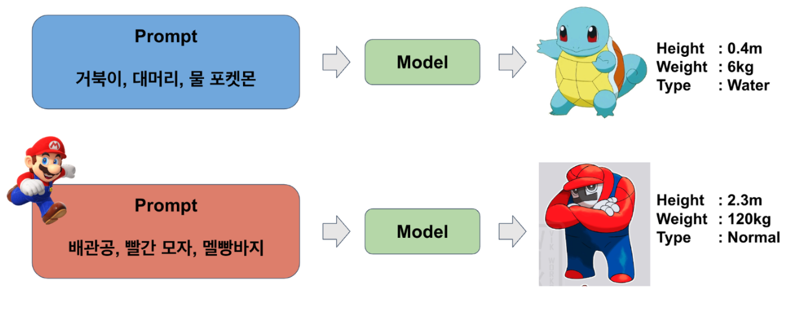

# Pokemon Generator

This project aims to implement a model that generates new Pokemon images and tabular data based on a given text prompt. It utilizes data from Kaggle's "The Complete Pokemon Dataset" (Link: [Kaggle Dataset](https://www.kaggle.com/datasets/rounakbanik/pokemon)) and additional collected data.

## Key Objectives
- Data Construction
- Data Processing
- Multimodal (Tabular, Text, Image) Generation
- Prompt Engineering
- LoRA (Language-Image Integration)
- Addressing Class Imbalance

## Keywords
Data Construction, Data Processing, Multimodal, Prompt Engineering, LoRA, Class Imbalance

## Libraries Used
- PyTorch
- Pandas
- Selenium
- ChatGPT API
- Hugging Face Transformers

## Model

.png)

## Result

 

| Height      | Weight  | Attack      | Defense  | SP Attack   | SP Defense  | 
| ------      | ------  | ----        | -------  | -------     | ---------   | 
| 0.7         | 34.8    | 66          | 37       | 50          | 92          | 

 **MSE Error for Tabular Data: 10 ~ 20**  

 **Accuracy for 18 Types: 60.2%**  

If you have any questions or if there's anything you'd like to know more about the project, feel free to reach out! Your curiosity and engagement are highly valued. I'm here to provide any assistance or information you may need to make your experience with the Pokemon Generator even more enjoyable and fulfilling. Wishing you an exciting journey of exploration and creativity! 🌟🔍🚀

**Note:**
This project is non-commercial and does not release collected data to prevent misuse.